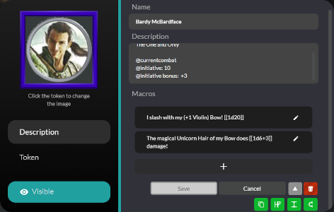
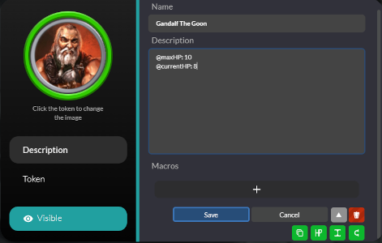

# MythicTableExtension
A Browser Extension to temporarily add functionality to Mythic Table while it's in development.


* <a href="#features">Features</a>
* <a href="#installation">Installation</a>
* <a href="#usage">Basic Usage</a>
  * <a href="#initiative">Initiative Tracker</a>
  * <a href="#copy">Copy Character</a>
  * <a href="#hp">HP Indicator</a>
* <a href="#faq">FAQ/Troubleshooting</a>

<br/>
<h1 id="features">Implemented Features:</h1>

* Initiative Tracker
  * See Characters and Initiatve values in the sidebar
  * Automatically Sorted
  * Automatically Selects the current Character in initiatve
  * Can be used to select Tokens on the map
* Copy Character
  * Allows you to Copy Characters or Tokens for use in other Campaigns
  * Can also be used to save a modified Token as a new Character
* HP Indicator
  * This feature sets the color of the Token's Border Color to a gradient between <span style="color:green;">Green</span> (full health) and <span style="color:red;">Red</span> (0 HP)
  *  When the Token is reduced to 0 HP, the "*Death Skull*" icon will be set on the Token. The skull is automatically removed when the Token's HP raises above 0.

<br/>
<h1 id="installation">Installation</h1>

<ol>
    <li>Download the crx file from the current Release Version
        <ol>
            <li>Alternatively, download or clone the git repo and use the contained copy of the Extension</li>
            <li>If you want to develop additional features or fix bugs, create a fork and clone your own fork</li>
        </ol>
    </li>
    
    <li>Navigate to your browser's Extension Manager</li>
    <li>As this Extension is not available via a store, you'll need to enable Developer Mode in order to install it</li>
    
    <li>To add the extension:
        <ol>
            <li> If you are using the crx file, you should be  able to drag-and-drop the file directly onto the Extension page</li>
            <li> If you downloaded/cloned the repo: unzip it, click the "load unpacked" button, and navigate to the unzipped folder and select the Extension's folder
            </li>
        </ol>
    </li>
</ol>

<h1 id="usage">Usage</h1>
As of Release Version 1.02 the following will following will automatically be added to the Mythic Table UI (previously these needed to be manually actiated):

* Create the GM Token (be sure to see below)
* Add the Initiative Tracker to the sidebar
* Populate the Initiatve Tracker with any appropriately tagged Tokens
* Set the Border and Icons for any Tokens with HP Indicator tags

**A Note about Tags**- Unless otherwise specified, each individual tag should be on a separate line in the character/token's description, e.g.:
```
// Correct Format
@currentcombat
@initiative: 14

// Incorrect Format
@currentcombat @initiative: 14
```


<br/>
<h2 id="initiative">Using the Initiative Tracker</h2>


**Adding Tokens to the Initiatve Tracker Automatically**
* Click on the Page Action (Toolbar Icon)
* Click the "Add All Tokens to Initiative" button
  * This will add `@currentcombat`, `@initiative: 0`, and `@initiative bonus: +0` to all tokens on the current Map owned by the Player
    * If the Player is the GM, all tokens will be updated regardless of owner
  * Update each token's description to the appropriate initiatve and initiative bonus values

**To add tokens to the Initiative Tracker Manually**
* Open the Token Editor for the token you want to add to the list
* Add the following tags (each tag should be on its own line):
  * `@currentcombat` - This adds the Token to the Initiative Tracker
  * `@initiative: {initiative value}`- Sets the character's initiative so it can be sorted in the list
  * `@initiative bonus: {+- Bonus}`- Used as a tiebreaker when two characters have the same initiative
* Save the token: it will automatically be added and the Initiative List will be resorted



**Finding Tokens on the List**
* You can click on any token on the Initiative List and it will be automatically selected on the Map

**Using the Tracker**
* The GM has access to arrows which changes the current character's turn. Each time the GM does so, the new token is automatically selected on the Map


<h2 id="copy">Using the Copy Character</h2>


**Copying**
* Whenever you open the Character or Token Editor, a Copy Button is added to the dialog box. Clicking this will store the Character in the Extension's storage
  * Note that this will only save the current version of the token: any change you make in the current dialog will not be reflected in the storage

**Pasting**
* In the Page Action (Toolbar Icon) Popup, the Paste Button is initially disabled. Once you copy a Character (or Token) the Paste Button will be enabled and the Popup will display the name of the copied Character
* By clicking the Paste Button, the Character will be added to the current Campaign

<br/>
<h2 id="hp">Using the HP Indicator</h2>


**Important Note-** To enable this feature the GM must be running this extension: this requirement is in place to prevent duplicate updates to tokens.



**Setting HP on all Tokens Automatically**
* Click on the Page Action (Toolbar Icon)
* Click the "Add HP for All Tokens" button
  * This will add `@maxHP: 0` and `@currentHP: 0` to all tokens owned by the Player on the current Map
  * Each Hidden Token owned by the Player (the GM) will be added to the *GMCHARACTER*
  * Update each token's description to the appropriate hp values
  * Update the HP values on the GMCHARACTER to the appropriate values

**Setting HP on individual Tokens Manually**
* Anyone can setup the HP Indicator for tokens they have access to by setting two tags: `@maxHP` and `@currentHP`
  * `@maxHP: {number}` sets the token's Maximum HP
  * `@currentHP: {number}` sets the token's Current HP
  * Both tags are required


**Setting HP on the GMCHARACTER Manually**
* As the GM, you can use the HP Indicator without your Players being able to see the tokens' HP values by setting the `@hptracker` tag on the *GMCHARACTER*.
* `@hptracker{}` is a special tag: the curly brackets in this case are required as the tag is a list
  * Inside of the curly brackets you can define token HP using the format: `{token name}: {currentHP}/{maxHP}`
  * Each token declaration must be separated by a new line

<br/>
<h1 id="faq">FAQ/Troubleshooting</h1>

**My Extension Manager won't let me enable the Extension because it's from an unknown source!**
<div class="indented">
This normally occurs because you are using the crx file: in this case you have two options: 1) unzip the crx file (it <i>is</i> actually a zip file with a different file extension) and load it as an "Unpacked Extension" instead; or 2) On windows, <a href="https://stackoverflow.com/a/48990515">see this answer</a> to add the extension ID to your browsers <b>ExtensionInstallAllowlist</b> Policy (requires editing the Windows Registry and restarting your browser afterwards). You should be able to copy the extension ID out of the Extension Manager.
</div>
<br/>

**The Arrows on the Initiative Tracker and the Token Images are Ginormous!**
<div class="indented">
Refreshing your webpage normally fixes this. While this is inconvenient, it generally only happens once. The CSS (styling) for those objects are added to the page by your Browser at the behest of the MTE: if your Browser fails to load that stylesheet we won't really know within the Extension. If this becomes a more prevelant problem we may simply hard-code the styling into the elements, but as it rarely happens we've decided to live with it for the time being.
</div>
<br/>

**My Border type keeps changing from Circle/Square to Coin!**
<div class="indented">
Assumeably this is because you are using the HP Indicator. The Circle and Square Border types do not display Border Color, which would prevent the HP Indicator from working as intended: it therefore automatically changes the Border type to Coin so that it can display the correct Border Color.

<br/>

If you want a square Border, set it to Tile and the HP Indicator will not change it.

If you don't want the HP Indicator to change the Border type, remove the `@maxHP` and/or `@currentHP` tags from the token and/or remove the token from the `@hptracker` list on the *GMCHARACTER*.
</div>